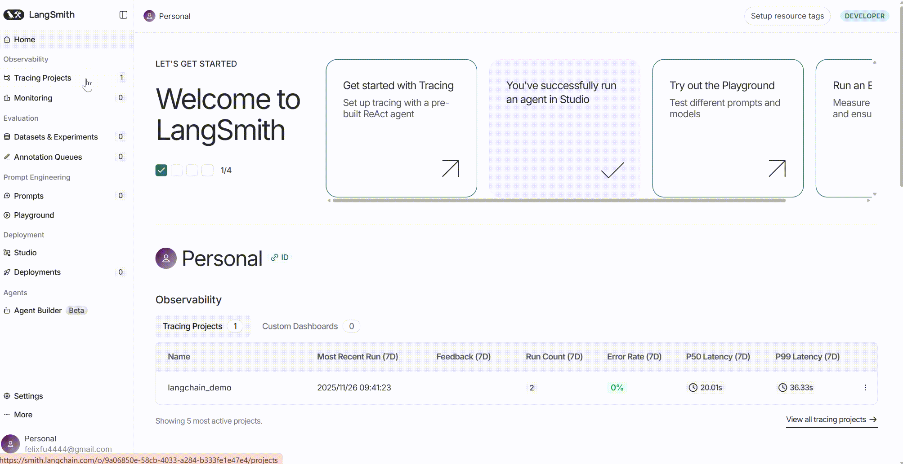
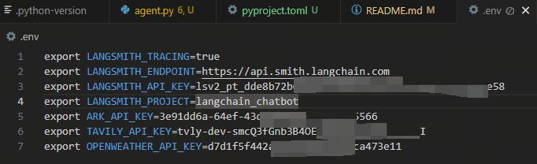

# langchain_chatbot
## 环境配置
### 1. 注册langsmith&获取 api key

复制Configure environment，然后在新建.env文件，把环境变量粘贴到.env文件中
### 2. 注册Tavily&获取api key
https://app.tavily.com/home
### 3. 注册火山引擎豆包大模型&获取api key
https://console.volcengine.com/ark
### 4. 完整的.env如下

### 5. 安装环境
```
git clone https://github.com/FelixFu520/langchain_chatbot.git
cd langchain_chatbot
uv sync # 如果没有安装uv，参考https://docs.astral.sh/uv/getting-started/installation/
```

## 运行
### 1. 启动
```
source .venv/bin/activate
langgraph dev
```
