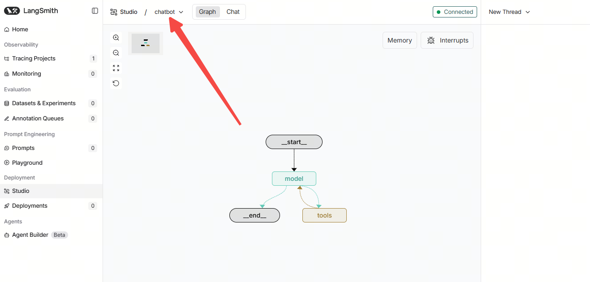

# langchain_chatbot
## 环境配置
### 1. 注册langsmith&获取 api key

复制Configure environment，然后在新建.env文件，把环境变量粘贴到.env文件中
### 2. 注册Tavily&获取api key
https://app.tavily.com/home
### 3. 注册火山引擎豆包大模型&获取api key
https://console.volcengine.com/ark
### 4. 注册OpenWeather&获取api key
https://openweathermap.org/api/

这个demo没用到查询天气工具，所以可以忽略这个api
### 5. 完整的.env如下

### 6. 安装环境
```
cd $HOME
git clone https://github.com/FelixFu520/langchain_chatbot.git
cd langchain_chatbot
uv sync # 如果没有安装uv，参考https://docs.astral.sh/uv/getting-started/installation/
```

## 运行后台
### 1. 启动
```
source .venv/bin/activate
langgraph dev
```


## 运行前端界面
刚刚是在langsmith中演示的对话，langchain提供了前端langchain-ui(https://github.com/langchain-ai/agent-chat-ui.git)

### 1. 安装
新起个终端
```
cd $HOME
git clone https://github.com/langchain-ai/agent-chat-ui.git
cd agent-chat-ui

# 安装nvm, node.js, npm, pnpm
curl -o- https://raw.githubusercontent.com/nvm-sh/nvm/v0.39.7/install.sh | bash
source ~/.bashrc 
nvm list-remote # 查看可用的 Node.js 版本
nvm install --lts # 安装一个稳定版本
node --version
npm --version
npm install -g pnpm
pnpm --version

# 安装项目依赖
pnpm install
```
### 2. 运行
```
pnpm dev
```
修改下图中的`Assistant/Graph ID`为langsmith中设置的名称，我这里是`chatbot`, 然后把langsmith的apikey拷贝过来, 就是前面贴到.env文件中的LANGSMITH_API_KEY



运行录屏


## 注意
我用的远程服务器跑的项目， 所以端口都是通过cursor转发的，如果需要部署的话，路由需要调整下
